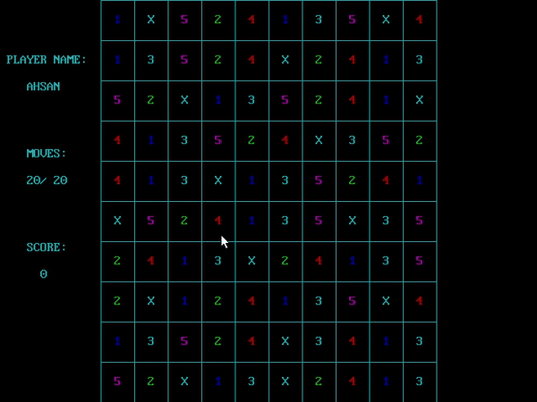
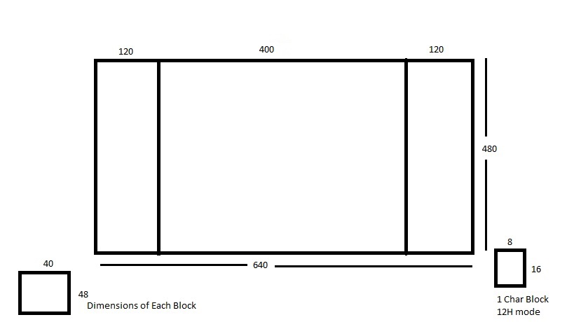

# NumberCrush

Number Crush is a "match three numbers" game written in assembly language. 



## Executing program

* Download MASM611 and DOSBox
* Copy Project files (Game.asm & GUImac.inc) to MASM611\BIN
* Open DOSBox and execute following
```
> mount f <MASM611\BIN path>
> f:
> pwb.exe
```
* Open Game.asm from 'File>Open'
* Run program from 'Run > Exectue Game.EXE > Build Target > Run Program'


## Gameplay

The core gameplay is based on swapping two adjacent numbers among several on the game board as to make a row or column of at least 3 matching-numbers. The matched numbers are removed from the board, and numbers above them fall into the empty spaces, with new numbers appearing from the top of the board. The board consists of 10*10 blocks on the screen having first 5 numbers on random indices. . The board has blockers (represented by ‘X’) which can only be removed if a combination is formed beside them horizontally or vertically. The blocker cannot be swapped with adjacent cell or block. Upon destruction of blocker, a Bomb (represented by ‘B’) occurs which swapped with any number in the adjacent cell destroys that particular number in the whole board.


## Implementation

* The game works on 12h mode having resolution 640x480. Basic board layout is shown in the figure. 
* The level proceeds on number of moves (20 are available to player). 
* Any adjacent block or cell can be swapped except diagonals.
* Player name is asked at the start of the game. 
* Two mouse inputs are obtained during drag. One on the mouse click and second on releasing that mouse click.
* Using procedure PIXELTOCELL, the coordinates are converted to appropriate row and column for the board and adjacency is checked. ( Block is not swapped in diagonal )
* The board is checked for the combinations made using procedure PERFORM_CRUSHING. The combinations are made -1 (convention for empty space) and procedure DROPPING_RANDOM_NUMBERS is called which moves the empty spaces upwards in the board and generates a random number at that location.
* The game terminates when the player runs out of moves.



## Environment

* Windows 10
* DOSbox 0.74-3
* MASM 6.11

